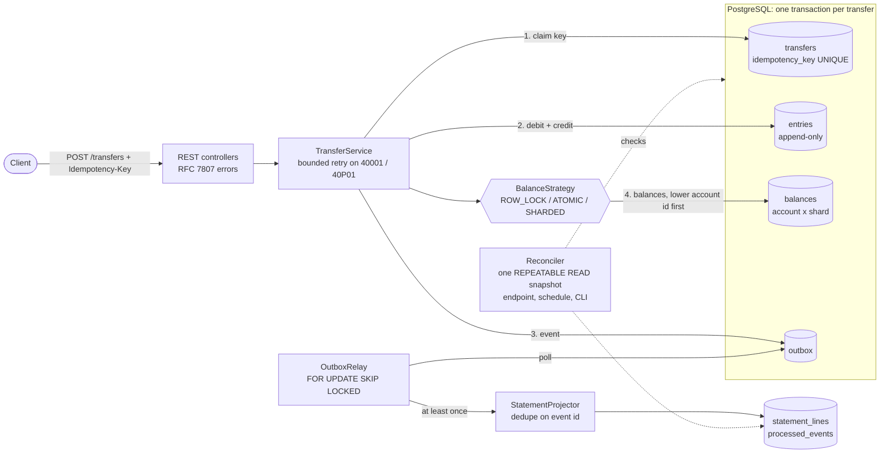

# payments-ledger

[](https://github.com/Arjun-B-J/payments-ledger/actions/workflows/ci.yml)

A double-entry payments ledger service on PostgreSQL. It moves money between accounts with idempotent, optionally two-phase transfers, keeps balances correct under heavy contention on a single "hot" account, publishes events through a transactional outbox, and ships a reconciler that re-proves the books from the journal.

Java 17, Spring Boot 3.5, Spring JDBC (explicit SQL, no JPA), Flyway, PostgreSQL 17 (embedded for tests and local runs), Micrometer with Prometheus.

## Why double entry

Every posted transfer writes two journal entries: a debit of `-amount` on the source account and a credit of `+amount` on the destination. So:

- each transfer sums to zero, and so does the whole journal; money can only move, never appear or vanish;
- the journal is append-only (a trigger rejects `UPDATE` and `DELETE`), so a balance can always be recomputed and audited;
- the `balances` table is a derived cache of the journal, and the reconciler checks that it still matches.

Money enters the system through an account that is allowed to go negative (the "funding" account in the examples), exactly as a bank's settlement account would.

## Architecture



Inside one transfer transaction the journal rows are written first and the contended balance rows last, in ascending account id order, so hot-row locks are held briefly and two transfers can never deadlock each other. See [docs/DECISIONS.md](docs/DECISIONS.md) for the reasoning behind every choice.

### Hot-account strategies

A merchant receiving half of all payments turns one balance row into a queue. Three strategies sit behind one `BalanceStrategy` interface (`ledger.strategy`):

| Strategy | How a leg updates the balance | Hot-account behaviour |
|---|---|---|
| `ROW_LOCK` | `SELECT ... FOR UPDATE`, decide in Java, `UPDATE` the computed value | Serializes, and holds the lock across extra round trips |
| `ATOMIC` (default) | One `UPDATE ... WHERE balance_minor >= :amt RETURNING` | Serializes, fewer round trips under the lock |
| `SHARDED` | N rows per account: credits hit a random shard, debits drain shards in fixed order | Up to N credits in parallel |

Overdraft is always refused by SQL: the conditional `UPDATE`, backed by `CHECK (allow_overdraft OR balance_minor >= 0)`.

## Quickstart

Needs only a JDK 17. PostgreSQL 17 binaries are pulled from Maven by zonky `embedded-postgres`; nothing else to install.

```bash
./mvnw verify                 # build + 31 tests on embedded Postgres (Windows: mvnw.cmd verify)
./mvnw -DskipTests package
java -jar target/payments-ledger-0.1.0-SNAPSHOT.jar      # API on :8080, embedded Postgres
```

Use a real PostgreSQL instead:

```bash
SPRING_DATASOURCE_URL=jdbc:postgresql://localhost:5432/ledger \
SPRING_DATASOURCE_USERNAME=ledger SPRING_DATASOURCE_PASSWORD=secret \
java -jar target/payments-ledger-0.1.0-SNAPSHOT.jar
```

Flyway creates the schema on start. Keep embedded data between runs with `--ledger.db.embedded-data-dir=data/pg`.

### Try it

A session run against `java -jar target/payments-ledger-0.1.0-SNAPSHOT.jar` (outputs trimmed only where marked):

```bash
# Accounts. "funding" may go negative: it is where money enters the ledger.
curl -s -X POST localhost:8080/accounts -H 'Content-Type: application/json' -d '{"name":"funding","currency":"USD","allowOverdraft":true}'
curl -s -X POST localhost:8080/accounts -H 'Content-Type: application/json' -d '{"name":"alice","currency":"USD"}'
curl -s -X POST localhost:8080/accounts -H 'Content-Type: application/json' -d '{"name":"merchant","currency":"USD","shards":8}'
# {"id":3,"name":"merchant","currency":"USD","allowOverdraft":false,"shards":8,"balanceMinor":0,...}

# Fund alice with 100.00
curl -s -X POST localhost:8080/transfers -H 'Content-Type: application/json' -H 'Idempotency-Key: fund-alice-1' \
  -d '{"debitAccountId":1,"creditAccountId":2,"amountMinor":10000,"currency":"USD"}'
# {"id":"a440cd21-...","debitAccountId":1,"creditAccountId":2,"amountMinor":10000,"currency":"USD","status":"POSTED",...}

# Same key, same body: the original response again, and no second movement
curl -s -i -X POST localhost:8080/transfers -H 'Content-Type: application/json' -H 'Idempotency-Key: fund-alice-1' \
  -d '{"debitAccountId":1,"creditAccountId":2,"amountMinor":10000,"currency":"USD"}' | grep -iE '^(HTTP|Idempotent-Replayed)'
# HTTP/1.1 201
# Idempotent-Replayed: true

# Same key, different body
curl -s -X POST localhost:8080/transfers -H 'Content-Type: application/json' -H 'Idempotency-Key: fund-alice-1' \
  -d '{"debitAccountId":1,"creditAccountId":2,"amountMinor":9999,"currency":"USD"}'
# {"type":"urn:ledger:problem:idempotency-key-reused","title":"Idempotency key reused","status":409,...}

# Two-phase: reserve 25.00 for the merchant, then post it
curl -s -X POST localhost:8080/transfers -H 'Content-Type: application/json' -H 'Idempotency-Key: order-42' \
  -d '{"debitAccountId":2,"creditAccountId":3,"amountMinor":2500,"currency":"USD","pending":true}'
# {"id":"d54eed61-2481-485e-87df-2beaa34fa7f7",...,"status":"PENDING",...}
curl -s localhost:8080/accounts/2
# {"id":2,"name":"alice",...,"balanceMinor":7500,...}        <- the hold already counts
curl -s -X POST localhost:8080/transfers/d54eed61-2481-485e-87df-2beaa34fa7f7/post
# {...,"status":"POSTED",...}

# Overdraft is refused
curl -s -X POST localhost:8080/transfers -H 'Content-Type: application/json' -H 'Idempotency-Key: too-much' \
  -d '{"debitAccountId":2,"creditAccountId":3,"amountMinor":1000000,"currency":"USD"}'
# {"type":"urn:ledger:problem:insufficient-funds","title":"Insufficient funds","status":422,"detail":"account 2 cannot cover 1000000 minor units",...}

# Entries, newest first, keyset-paginated (?limit=&before=<nextCursor>)
curl -s 'localhost:8080/accounts/2/entries?limit=10'
# {"items":[{"id":3,...,"direction":"D","amountMinor":-2500,...},{"id":2,...,"direction":"C","amountMinor":10000,...}],"nextCursor":null}

curl -s localhost:8080/reconciliation
# {"ranAt":"...","ok":true,"transfers":2,"entries":4,"accounts":3,"readModelChecked":true,"readModelNote":"outbox drained; statement lines compared with entries","violations":[]}

curl -s localhost:8080/actuator/prometheus | grep -E '^ledger_(outbox_lag_seconds|reconciler_violations)'
# ledger_outbox_lag_seconds 0.0
# ledger_reconciler_violations 0.0
```

### Reconciler

| Way to run | How |
|---|---|
| HTTP | `GET /reconciliation` |
| Schedule | every `ledger.reconciler.interval-ms` (default 60 s), logs an error and sets the `ledger.reconciler.violations` gauge |
| CLI | `java -jar target/payments-ledger-0.1.0-SNAPSHOT.jar --spring.main.web-application-type=none --ledger.cli=reconcile` prints the report as JSON; exit code 1 on violations |

Checks, all in one snapshot: (i) each posted transfer has exactly one debit and one credit that cancel out and match the transfer; pending and voided transfers have no entries; (ii) the whole journal sums to zero; (iii) each account's balance (sum of its shards) equals its entries minus pending holds; (iv) no negative balance where overdraft is not allowed; (v) once the outbox is drained, the statement read model matches the journal.

### Metrics

`/actuator/prometheus` exposes, among the standard JVM and Hikari metrics:

| Metric | Meaning |
|---|---|
| `ledger_transfer_latency_seconds{strategy,operation,outcome}` | Histogram per strategy for create, post and void; outcome is posted, pending, replayed, rejected, and so on |
| `ledger_transfer_retries_total{strategy,reason}` | Transactions re-run after a deadlock or serialization failure |
| `ledger_outbox_lag_seconds`, `ledger_outbox_unpublished` | Age of the oldest undelivered event, and how many are waiting |
| `ledger_projector_events_total{result}` | Events applied to the read model vs. duplicates skipped |
| `ledger_reconciler_violations` | Violations found by the last reconciler run |

Log lines written while a transfer is being processed carry `[transfer=<id>]` through the logging MDC.

## Benchmark

Same harness in two modes: 64 concurrent clients, 5 s warm-up, 15 s measured, on a laptop (Intel Core Ultra 9 275HX, 24 logical CPUs, 32 GB) with embedded PostgreSQL 17.11. SKEWED sends 50% of transfers to one merchant account; UNIFORM spreads them over 1,000 users. Windows: use `mvnw.cmd`.

### Durable commits (the headline)

`./mvnw -B -Pbench test -Dbench.clients=64 -Dledger.db.embedded-durable=true`. `fsync`, `synchronous_commit` and `full_page_writes` are on, so a transfer is acknowledged only after its commit reaches the disk. Two runs:

| Workload | Strategy | Run 1 transfers/s | Run 2 transfers/s | Run 1 p99 ms | Run 2 p99 ms |
|---|---|---:|---:|---:|---:|
| SKEWED | ROW_LOCK | 4,044 | 3,404 | 136.19 | 170.24 |
| SKEWED | ATOMIC | 5,334 | 4,135 | 98.75 | 134.91 |
| SKEWED | SHARDED (16 rows) | 10,871 | 10,902 | 29.34 | 30.80 |
| UNIFORM | ROW_LOCK | 10,765 | 10,757 | 34.98 | 17.60 |
| UNIFORM | ATOMIC | 12,424 | 12,757 | 28.53 | 16.06 |
| UNIFORM | SHARDED | 12,304 | 12,280 | 28.43 | 22.21 |

Every run: 0 errors, 0 deadlock or serialization retries, and 0 reconciler violations, including the read-model check.

### Embedded defaults (`fsync=off`)

`./mvnw -B -Pbench test -Dbench.clients=64`. Commits do not wait for the disk, so this is an upper bound, not a way to run a ledger. One run:

| Workload | Strategy | Transfers/s | p50 ms | p99 ms | Errors | Retries | Reconciler violations |
|---|---|---:|---:|---:|---:|---:|---:|
| SKEWED | ROW_LOCK | 5,440 | 1.36 | 87.87 | 0 | 0 | 0 |
| SKEWED | ATOMIC | 9,832 | 1.32 | 46.02 | 0 | 0 | 0 |
| SKEWED | SHARDED (16 rows) | 20,968 | 2.11 | 17.66 | 0 | 0 | 0 |
| UNIFORM | ROW_LOCK | 18,890 | 1.55 | 25.18 | 0 | 0 | 0 |
| UNIFORM | ATOMIC | 21,503 | 1.45 | 36.58 | 0 | 0 | 0 |
| UNIFORM | SHARDED | 21,713 | 1.31 | 34.62 | 0 | 0 | 0 |

### What it shows

- With one hot account, throughput is set by how long its row stays locked. With durable commits, SHARDED did 2.7x (run 1) and 3.2x (run 2) the throughput of ROW_LOCK and cut p99 latency by 78% and 82%.
- SHARDED kept the skewed workload within 12% of its own uniform throughput in both runs (about 10.9k against 12.3k transfers/s): the hot account stopped being the bottleneck.
- ATOMIC helped less with durable commits (1.2x to 1.3x ROW_LOCK) than without (1.8x): once every commit waits for the disk, the flush, not the extra round trip, dominates how long the row stays locked.
- The single-row strategies under contention are the noisy cells: run 2 was 16% (ROW_LOCK) and 22% (ATOMIC) below run 1 on SKEWED, while SHARDED and every UNIFORM cell moved less than 3%. Read the ratios, not the absolute values.
- Durability costs about 42% of uniform throughput (roughly 21.5k down to 12.4k transfers/s): the price of waiting for the disk.
- 18 runs across both modes, all with the ledger balanced: the outbox drained and the reconciler found nothing.

Full setup, p95 and raw data: [docs/BENCHMARKS-durable.md](docs/BENCHMARKS-durable.md) (run 2), [docs/benchmark-results-durable-run1.json](docs/benchmark-results-durable-run1.json) (run 1) and [docs/BENCHMARKS.md](docs/BENCHMARKS.md) (embedded defaults).

## Tests

31 tests, all against embedded PostgreSQL 17 with the real schema:

| Test class | What it proves |
|---|---|
| `LedgerApiTest` | HTTP API end to end: posting, replay returns the original response, 409 on a reused key, 422 overdraft and currency mismatch, 400/404 problem responses, pending then post, pending then void, holds count against the balance, keyset pagination, metrics and reconciliation endpoints |
| `IdempotencyConcurrencyTest` | 32 concurrent requests with one key create exactly one transfer; with different bodies exactly one wins and 31 get 409 |
| `StrategyConcurrencyTest` | For each strategy, 32 threads x 150 random transfers among 20 users and a hot account (credited and debited, some refused, some two-phase): money is conserved, all balances sum to zero, the reconciler finds nothing |
| `FaultInjectionTest` | A crash between the debit and credit legs rolls back everything (each strategy); a crash after commit but before the response is replayed safely; a relay crash after delivery redelivers and the read model applies each event once |
| `ReconcilerTest` | The reconciler catches a tampered balance, an unbalanced journal and a wrong read model; the database itself refuses a negative balance and any edit to the journal |
| `TransientRetryTest`, `TransferCommandTest` | Retry only on 40001/40P01 and give up after the limit; the request hash covers every field |

## What it does not do

- No authentication, authorization or tenancy. Idempotency keys are global and never expire.
- One currency per transfer; no FX.
- No `BATCHED` (micro-batching) strategy; see decision 10.
- No Kafka, Debezium or Redis. The outbox sink is in-process; a broker would plug in behind `OutboxSink`.
- Pending holds do not expire, and there is no refund or reversal endpoint (a correction is a new transfer).
- The benchmark measures the service and database layer in one JVM, not HTTP, on a laptop with embedded PostgreSQL. The durable run flushes every commit to disk, but it is still one laptop, not a production-tuned server.

## Layout

```
src/main/java/com/arjunbj/ledger/
  account/    accounts, entries API, keyset pagination
  balance/    BalanceStrategy + ROW_LOCK, ATOMIC, SHARDED
  transfer/   TransferService (idempotency, two-phase, lock ordering), REST
  outbox/     outbox repository, SKIP LOCKED relay, idempotent statement projector
  recon/      reconciler, endpoint, schedule, CLI
  common/     problem responses, retry, fault-injection points
  config/     embedded PostgreSQL
src/main/resources/db/migration/V1__ledger_schema.sql
docs/DECISIONS.md, docs/BENCHMARKS.md, docs/BENCHMARKS-durable.md
```

## License

MIT, see [LICENSE](LICENSE).
